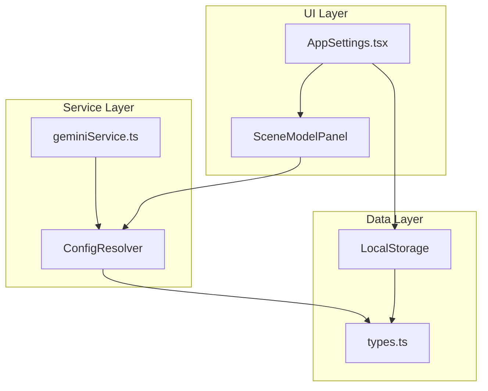

# Design Document: Cross-Provider Model Configuration

## Overview

本设计扩展现有的场景模型配置系统，实现完整的跨服务商支持。核心改进是将 `SceneModels` 中的每个场景从简单的模型名称字符串升级为支持完整的 `SceneModelConfig` 对象，同时保持向后兼容。

关键设计目标：
1. **向后兼容** - 现有的字符串配置继续工作
2. **类型安全** - 使用 TypeScript 联合类型处理混合配置
3. **集中解析** - 单一函数处理所有配置解析逻辑
4. **UI 友好** - 清晰的配置界面，支持快速切换和测试

## Architecture



## Components and Interfaces

### 1. Type Definitions (types.ts)

现有类型已定义，需要添加辅助类型：

```typescript
// 已存在
export interface SceneModelConfig {
  provider: AIProvider;
  apiKey: string;
  baseUrl?: string;
  model: string;
}

// 已存在
export interface SceneModels {
  creative?: string | SceneModelConfig;
  structure?: string | SceneModelConfig;
  writing?: string | SceneModelConfig;
  analysis?: string | SceneModelConfig;
}

// 新增：解析后的完整配置（所有字段必填）
export interface ResolvedModelConfig {
  provider: AIProvider;
  apiKey: string;
  baseUrl: string;
  model: string;
}

// 新增：场景类型
export type AISceneType = 'creative' | 'structure' | 'writing' | 'analysis';
```

### 2. Configuration Resolver (geminiService.ts)

新增集中配置解析函数：

```typescript
/**
 * 解析场景配置，返回完整的模型配置
 * 处理三种情况：
 * 1. 完整 SceneModelConfig - 直接使用
 * 2. 字符串模型名 - 使用默认 provider 设置 + 指定模型
 * 3. 未配置 - 完全使用默认设置
 */
export function resolveSceneConfig(
  settings: AppSettings,
  scene: AISceneType
): ResolvedModelConfig {
  const sceneConfig = settings.sceneModels?.[scene];
  
  // 默认配置
  const defaultConfig: ResolvedModelConfig = {
    provider: settings.provider,
    apiKey: settings.apiKey,
    baseUrl: settings.baseUrl || '',
    model: settings.model
  };
  
  if (!sceneConfig) {
    return defaultConfig;
  }
  
  if (typeof sceneConfig === 'string') {
    return { ...defaultConfig, model: sceneConfig };
  }
  
  // 完整 SceneModelConfig
  return {
    provider: sceneConfig.provider,
    apiKey: sceneConfig.apiKey,
    baseUrl: sceneConfig.baseUrl || '',
    model: sceneConfig.model
  };
}

/**
 * 根据解析后的配置创建 AI 客户端
 */
export function createAIClient(config: ResolvedModelConfig) {
  if (config.provider === 'google') {
    return getGoogleAI({ ...config } as AppSettings);
  } else {
    return { callOpenAI, config };
  }
}
```

### 3. Scene Model Panel Component

新增独立的场景配置面板组件：

```typescript
interface SceneModelPanelProps {
  scene: AISceneType;
  sceneName: string;
  sceneDescription: string;
  config: string | SceneModelConfig | undefined;
  defaultSettings: AppSettings;
  onChange: (config: string | SceneModelConfig | undefined) => void;
  onTest: () => Promise<boolean>;
}
```

## Data Models

### Configuration Storage Structure

```typescript
// LocalStorage key: 'app_settings'
{
  provider: 'google',
  apiKey: 'xxx',
  baseUrl: '',
  model: 'gemini-2.5-flash',
  sceneModels: {
    creative: 'gemini-2.5-flash',  // 字符串形式
    structure: {                    // 完整配置形式
      provider: 'deepseek',
      apiKey: 'sk-xxx',
      baseUrl: 'https://api.deepseek.com',
      model: 'deepseek-chat'
    },
    writing: {
      provider: 'openai',
      apiKey: 'sk-xxx',
      baseUrl: 'https://api.openai.com/v1',
      model: 'gpt-4o'
    },
    analysis: undefined  // 使用默认
  }
}
```

## Correctness Properties

*A property is a characteristic or behavior that should hold true across all valid executions of a system-essentially, a formal statement about what the system should do. Properties serve as the bridge between human-readable specifications and machine-verifiable correctness guarantees.*

### Property 1: Default Fallback Consistency
*For any* AppSettings with no scene configuration for a given scene, resolving that scene's config SHALL return a ResolvedModelConfig identical to the default settings (provider, apiKey, baseUrl, model).
**Validates: Requirements 1.3**

### Property 2: String Config Resolution
*For any* scene configured with only a model string, resolving that scene's config SHALL return a ResolvedModelConfig with the default provider, apiKey, baseUrl, but the specified model string.
**Validates: Requirements 2.3**

### Property 3: Full Config Passthrough
*For any* scene configured with a complete SceneModelConfig, resolving that scene's config SHALL return a ResolvedModelConfig with exactly the same provider, apiKey, baseUrl, and model values.
**Validates: Requirements 2.2**

### Property 4: Resolution Completeness
*For any* valid AppSettings and any scene type, resolving the config SHALL always return a ResolvedModelConfig with all four required fields (provider, apiKey, baseUrl, model) defined and non-undefined.
**Validates: Requirements 6.1, 6.2**

### Property 5: Copy Operation Integrity
*For any* source scene configuration, copying to a target scene SHALL result in the target having identical provider, apiKey, baseUrl, and model values as the source.
**Validates: Requirements 5.2**

### Property 6: Persistence Round-Trip
*For any* valid SceneModels configuration, saving to storage and then loading SHALL produce an equivalent configuration object.
**Validates: Requirements 1.4**

## Error Handling

### Configuration Validation Errors

| Error Condition | Handling Strategy |
|----------------|-------------------|
| Missing apiKey in SceneModelConfig | Fall back to default apiKey, show warning |
| Invalid provider value | Fall back to default provider |
| Empty model string | Fall back to default model |
| API test failure | Display error message, keep config editable |

### Runtime Errors

```typescript
// 配置验证函数
function validateSceneConfig(config: SceneModelConfig): string[] {
  const errors: string[] = [];
  if (!config.provider) errors.push('Provider is required');
  if (!config.apiKey) errors.push('API Key is required');
  if (!config.model) errors.push('Model is required');
  return errors;
}
```

## Testing Strategy

### Unit Tests

1. **resolveSceneConfig function**
   - Test with undefined scene config
   - Test with string model config
   - Test with full SceneModelConfig
   - Test with partial SceneModelConfig (missing optional fields)

2. **Configuration validation**
   - Test validateSceneConfig with valid configs
   - Test with missing required fields

3. **UI Component rendering**
   - Test SceneModelPanel renders all fields
   - Test default indicator display

### Property-Based Tests

使用 fast-check 库进行属性测试：

1. **Property 1-4**: 配置解析属性
   - 生成随机 AppSettings 和场景类型
   - 验证解析结果符合预期规则

2. **Property 5**: 复制操作属性
   - 生成随机源配置
   - 验证复制后目标与源相同

3. **Property 6**: 持久化往返属性
   - 生成随机 SceneModels
   - 验证 JSON.stringify/parse 往返一致性

### Integration Tests

1. **End-to-end configuration flow**
   - Configure a scene with custom provider
   - Trigger AI generation for that scene
   - Verify correct API is called

2. **Settings persistence**
   - Save settings with mixed scene configs
   - Reload application
   - Verify all configs restored correctly
