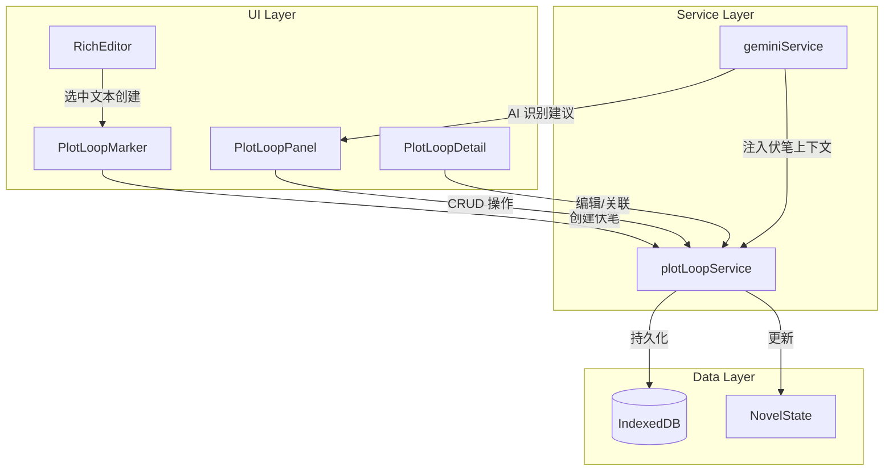

# Design Document: Plot Loop System

## Overview

伏笔追踪系统（Plot Loop System）是 InkFlow 的核心叙事管理功能，采用"开环/闭环"模型追踪小说中的伏笔生命周期。系统支持手动创建、AI 自动识别、状态自动流转、关联引用和层级伏笔链，确保长篇小说的叙事连贯性。

## Architecture



## Components and Interfaces

### 1. PlotLoopPanel Component

位于编辑器右侧栏的伏笔管理面板。

```typescript
interface PlotLoopPanelProps {
  plotLoops: PlotLoop[];
  currentChapterId: string | null;
  onCreateLoop: (loop: Partial<PlotLoop>) => void;
  onUpdateLoop: (id: string, updates: Partial<PlotLoop>) => void;
  onDeleteLoop: (id: string) => void;
  onSelectLoop: (loop: PlotLoop) => void;
}
```

功能：
- 按状态分组显示伏笔列表（URGENT → OPEN → CLOSED → ABANDONED）
- 筛选器：重要程度、关联章节/分卷、关键词搜索
- 快速创建伏笔按钮
- 拖拽伏笔到细纲输入框

### 2. PlotLoopDetail Component

伏笔详情编辑弹窗。

```typescript
interface PlotLoopDetailProps {
  loop: PlotLoop | null;
  chapters: Chapter[];
  volumes: Volume[];
  characters: Character[];
  wikiEntries: WikiEntry[];
  onSave: (loop: PlotLoop) => void;
  onClose: () => void;
}
```

功能：
- 编辑标题、描述、重要程度
- 设置目标章节/分卷
- 关联角色和 Wiki 词条
- 设置父伏笔（伏笔链）
- 状态变更（关闭/废弃）

### 3. PlotLoopMarker Component

编辑器内的伏笔标记浮动菜单。

```typescript
interface PlotLoopMarkerProps {
  selectedText: string;
  currentChapterId: string;
  onCreateLoop: (description: string, chapterId: string) => void;
}
```

功能：
- 选中文本后显示"设为伏笔"按钮
- 自动填充描述为选中文本
- 自动关联当前章节

### 4. plotLoopService

伏笔业务逻辑服务。

```typescript
// services/plotLoopService.ts

interface PlotLoopService {
  // CRUD
  createPlotLoop(loop: Partial<PlotLoop>): PlotLoop;
  updatePlotLoop(id: string, updates: Partial<PlotLoop>): PlotLoop;
  deletePlotLoop(id: string): void;
  
  // 查询
  getPlotLoopsByStatus(status: PlotLoopStatus): PlotLoop[];
  getPlotLoopsByChapter(chapterId: string): PlotLoop[];
  getPlotLoopsByVolume(volumeId: string): PlotLoop[];
  getOpenLoopsForContext(currentChapterId: string): PlotLoop[];
  
  // 状态管理
  checkAndUpdateUrgentStatus(currentChapter: Chapter, allChapters: Chapter[]): PlotLoop[];
  markAsClosed(id: string, closeChapterId: string): PlotLoop;
  markAsAbandoned(id: string, reason: string): PlotLoop;
  
  // 伏笔链
  getChildLoops(parentId: string): PlotLoop[];
  getLoopHierarchy(id: string): PlotLoop[];
  
  // AI 集成
  buildLoopContextForPrompt(currentChapterId: string): string;
  parseAISuggestedLoops(aiResponse: string): Partial<PlotLoop>[];
}
```

## Data Models

### PlotLoop Interface

```typescript
// types.ts

export enum PlotLoopStatus {
  OPEN = 'OPEN',           // 已埋下，未回收
  URGENT = 'URGENT',       // 急需回收（接近预定回收章节）
  CLOSED = 'CLOSED',       // 已回收
  ABANDONED = 'ABANDONED'  // 废弃
}

export interface PlotLoop {
  id: string;                      // UUID
  title: string;                   // 伏笔简述，如"神秘的断剑"
  description: string;             // 详细描述
  
  // 生命周期
  setupChapterId: string;          // 埋下伏笔的章节 ID
  targetChapterId?: string;        // 计划回收的章节 ID（可选）
  targetVolumeId?: string;         // 计划回收的分卷 ID（可选）
  closeChapterId?: string;         // 实际回收的章节 ID
  
  // 状态
  status: PlotLoopStatus;
  importance: number;              // 1-5，重要程度
  abandonReason?: string;          // 废弃原因
  
  // 关联
  relatedCharacterIds?: string[];  // 关联角色 ID 列表
  relatedWikiEntryIds?: string[];  // 关联 Wiki 词条 ID 列表
  parentLoopId?: string;           // 父伏笔 ID（伏笔链）
  
  // 元数据
  createdAt: number;               // 创建时间戳
  updatedAt: number;               // 更新时间戳
  aiSuggested?: boolean;           // 是否为 AI 建议创建
}
```

### NovelState Extension

```typescript
// types.ts - 扩展 NovelState

export interface NovelState {
  // ... 现有字段
  plotLoops: PlotLoop[];           // 全局伏笔列表
}
```

### IndexedDB Schema Update

```typescript
// services/db.ts - 升级 DB_VERSION

// 在 upgrade 回调中添加：
if (!db.objectStoreNames.contains('plotLoops')) {
  const store = db.createObjectStore('plotLoops', { keyPath: 'id' });
  store.createIndex('status', 'status', { unique: false });
  store.createIndex('setupChapterId', 'setupChapterId', { unique: false });
  store.createIndex('targetChapterId', 'targetChapterId', { unique: false });
  store.createIndex('importance', 'importance', { unique: false });
}
```


## Correctness Properties

*A property is a characteristic or behavior that should hold true across all valid executions of a system-essentially, a formal statement about what the system should do. Properties serve as the bridge between human-readable specifications and machine-verifiable correctness guarantees.*

### Property 1: Plot loop creation initializes required fields
*For any* valid plot loop creation input (title, description, setupChapterId, importance), the created plot loop SHALL have a unique ID, status set to OPEN, and all provided fields stored correctly.
**Validates: Requirements 1.1**

### Property 2: Partial update preserves unchanged fields
*For any* existing plot loop and any subset of fields to update, updating the plot loop SHALL modify only the specified fields while preserving all other fields unchanged.
**Validates: Requirements 1.2, 1.4**

### Property 3: Deletion removes plot loop from storage
*For any* existing plot loop, after deletion, querying for that plot loop by ID SHALL return null/undefined.
**Validates: Requirements 1.3**

### Property 4: Closing a plot loop sets CLOSED status and closeChapterId
*For any* OPEN or URGENT plot loop, marking it as closed with a chapter ID SHALL result in status being CLOSED and closeChapterId being set to the provided chapter ID.
**Validates: Requirements 1.5**

### Property 5: URGENT status triggers within 5 chapters of target
*For any* OPEN plot loop with a targetChapterId, when the current chapter order is within 5 of the target chapter order, the status check SHALL return URGENT.
**Validates: Requirements 2.1**

### Property 6: URGENT status triggers at volume end
*For any* OPEN plot loop with a targetVolumeId, when the current chapter is the last chapter in that volume, the status check SHALL return URGENT.
**Validates: Requirements 2.2**

### Property 7: Long-open loops without target are flagged
*For any* OPEN plot loop without targetChapterId or targetVolumeId, when the chapter gap between current chapter and setupChapter exceeds 30, the loop SHALL be flagged as requiring attention.
**Validates: Requirements 2.3**

### Property 8: Abandoning sets ABANDONED status with reason
*For any* plot loop and any non-empty reason string, abandoning the loop SHALL result in status being ABANDONED and abandonReason being set.
**Validates: Requirements 2.4**

### Property 9: Status grouping returns correct order
*For any* list of plot loops with mixed statuses, grouping by status SHALL return loops ordered as: URGENT first, then OPEN, then CLOSED, then ABANDONED.
**Validates: Requirements 3.1**

### Property 10: Filtering returns only matching items
*For any* list of plot loops and any filter criteria (importance, chapterId, volumeId, or keyword), filtering SHALL return only loops that match the criteria.
**Validates: Requirements 3.2, 3.3, 3.4**

### Property 11: Prompt context includes all OPEN and URGENT loops
*For any* set of plot loops, building the prompt context SHALL include all loops with status OPEN or URGENT, and exclude CLOSED and ABANDONED loops.
**Validates: Requirements 4.1, 4.4**

### Property 12: URGENT loops trigger priority instruction in prompt
*For any* set of plot loops containing at least one URGENT loop, the built prompt SHALL contain instruction text indicating priority handling for urgent loops.
**Validates: Requirements 4.2**

### Property 13: Linking associations persists IDs correctly
*For any* plot loop and any list of character IDs or wiki entry IDs, linking them SHALL result in the IDs being stored in relatedCharacterIds or relatedWikiEntryIds respectively.
**Validates: Requirements 5.1, 5.2**

### Property 14: Reverse lookup returns associated loops
*For any* character ID or wiki entry ID, querying plot loops by that ID SHALL return all loops that have that ID in their relatedCharacterIds or relatedWikiEntryIds.
**Validates: Requirements 5.3**

### Property 15: Creating from selection auto-populates fields
*For any* selected text and current chapter ID, creating a plot loop from selection SHALL result in description containing the selected text and setupChapterId set to the current chapter.
**Validates: Requirements 5.4**

### Property 16: Parent-child relationship is stored
*For any* plot loop with a parentLoopId set, querying child loops of that parent SHALL include the child loop.
**Validates: Requirements 6.1, 6.3**

### Property 17: Closing parent with open children triggers notification
*For any* parent plot loop with at least one child loop in OPEN or URGENT status, closing the parent SHALL trigger a notification about unclosed children.
**Validates: Requirements 6.2**

### Property 18: All children closed suggests parent closure
*For any* parent plot loop where all child loops have status CLOSED, the system SHALL suggest closing the parent.
**Validates: Requirements 6.4**

### Property 19: AI suggestion parser extracts loop data
*For any* AI response containing suggested plot loops in the expected format, parsing SHALL extract title and description for each suggested loop.
**Validates: Requirements 7.2**

### Property 20: Accepting AI suggestion creates loop with correct metadata
*For any* AI-suggested plot loop data and current chapter ID, accepting the suggestion SHALL create a loop with aiSuggested=true and setupChapterId set to current chapter.
**Validates: Requirements 7.3**

### Property 21: Persistence round-trip preserves data
*For any* list of plot loops, saving to IndexedDB then loading SHALL return an equivalent list of plot loops.
**Validates: Requirements 8.1, 8.2**

### Property 22: Export/Import round-trip preserves data
*For any* list of plot loops, exporting to JSON then importing SHALL return an equivalent list of plot loops.
**Validates: Requirements 8.3, 8.4**

## Error Handling

### Data Validation Errors
- **Invalid importance**: Reject importance values outside 1-5 range
- **Missing required fields**: Reject creation without title, description, or setupChapterId
- **Invalid status transition**: Prevent invalid transitions (e.g., CLOSED → OPEN)
- **Circular parent reference**: Prevent setting parentLoopId to self or descendant

### Storage Errors
- **IndexedDB unavailable**: Fall back to in-memory storage with warning
- **Quota exceeded**: Notify user and suggest cleanup of old closed loops
- **Concurrent modification**: Use optimistic locking with updatedAt timestamp

### AI Integration Errors
- **AI response parsing failure**: Log error and skip suggestion, don't block user workflow
- **Empty AI suggestions**: Silently ignore, no user notification needed

## Testing Strategy

### Unit Testing
- Test plotLoopService CRUD operations
- Test status transition logic
- Test filtering and grouping functions
- Test prompt context building
- Test AI response parsing

### Property-Based Testing

The system will use **fast-check** library for property-based testing in TypeScript.

Each property-based test MUST:
- Run a minimum of 100 iterations
- Be tagged with format: `**Feature: plot-loop-system, Property {number}: {property_text}**`
- Reference the correctness property from this design document

Key properties to test:
1. Creation always produces valid plot loop with OPEN status
2. Partial updates preserve unchanged fields (round-trip property)
3. Status grouping maintains correct order for any input
4. Filtering is idempotent and returns subset of input
5. Persistence round-trip preserves all data
6. Export/import round-trip preserves all data

### Integration Testing
- Test IndexedDB persistence with real browser storage
- Test AI prompt injection with mock geminiService
- Test UI components with React Testing Library
